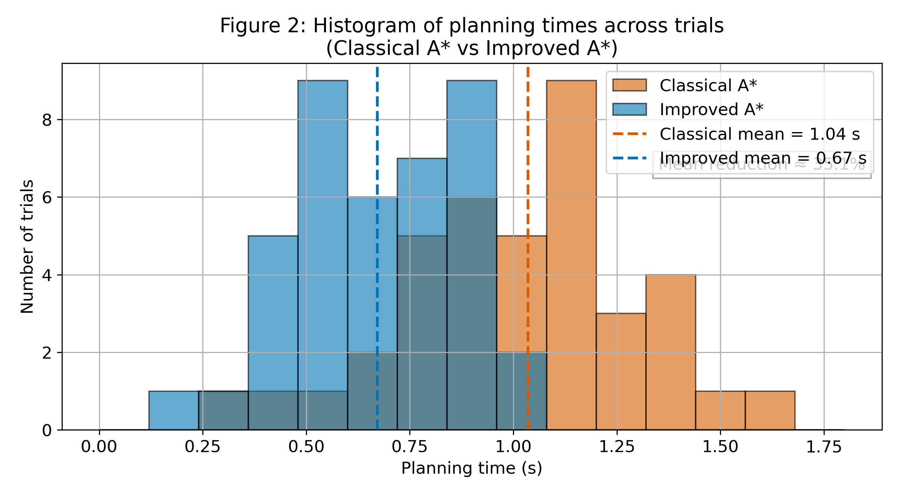
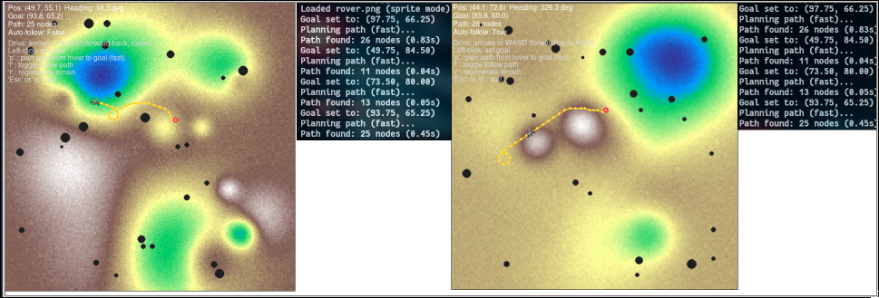
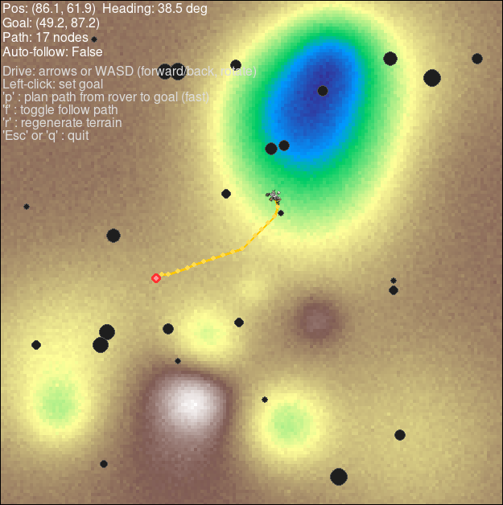
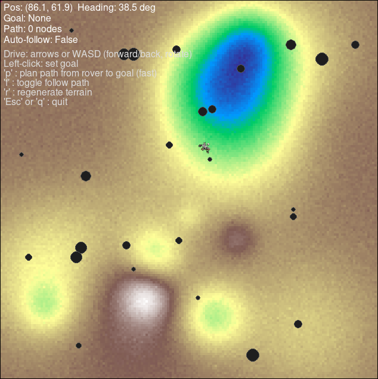
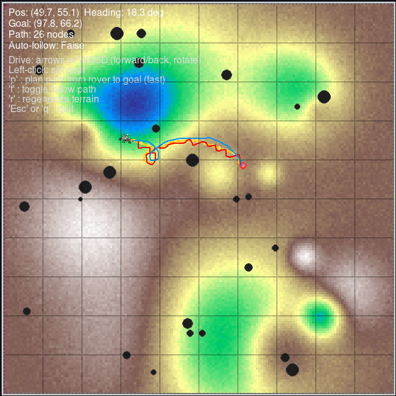

This repository contains a Pygame-based simulation and experimental code for evaluating path-planning and tracking control methods for planetary rovers. It implements and compares:

- **Improved A\*** with motion primitives (`rover_control_sim_fast.py`) — global planner that expands constant-curvature motion primitives in $(x,y,\theta)$ space and uses a terrain-aware cost model.
- **Grid-based A\*** (`rover_control_sim_astar.py`) — baseline classical 8-connected grid planner with per-cell terrain costs.
- **Arc-based local controller** — reactive controller that samples short circular arcs, scores them by multi-objective criteria (progress, alignment, safety), and executes the best arc.
- Utilities to generate synthetic DEMs, place procedural rocks, visualize simulation, and plot experimental results.

This project was developed as a case study for the research paper: **"An improved path planning and tracking control method for planetary exploration rovers with traversable tolerance"** (H. Zhang, F. Jiang, Q. Li — _Biomimetic Intelligence and Robotics_, 2025).

## Features

- Procedural terrain generator (DEM with Gaussian bumps + noise)
- Per-cell traversability / cost model (slope, roughness, rock proximity)
- Motion-primitive-based A\* planner (constant-curvature arcs)
- Baseline grid A\* planner for comparisons
- Arc-based local tracking controller
- Pygame visualization with interactive controls
- Logging utilities and plotting scripts to reproduce figures (e.g., planning time histogram)
- Easy-to-tune parameters for planner, controller, and terrain

## Screenshots & Figures

This section shows the main visualization assets used in the report and demo runs.

### Figure: Planning time histogram

The following chart summarizes planning-time distributions across 40 trials for the two planners (Classical A*vs Improved A*). The chart was generated by `plot_planning_time_hist.py` (synthetic/demo data).  
_File:_ `media/chart/planning_time_histogram.png`


_Figure 1 — Planning time histogram (Classical A_ vs Improved A*). The improved planner shows a ~30% reduction in mean planning time in our synthetic experiments.*

### Screenshot gallery

Interactive simulator screenshots (captured from example runs). Click an image to view full-size.

<div align="center">

[](media/screenshots/1.png)
[](media/screenshots/2.png)
[](media/screenshots/3.png)
[](media/screenshots/4.png)

</div>

## Requirements

Tested with Python 3.8+ on Linux

Install dependencies with:

```bash
python -m venv venv
source venv/bin/activate   # or `venv\Scripts\activate` on Windows
pip install -r requirements.txt
```

## Quick start — run the simulator

1. Clone repository:

```bash
git clone https://github.com/aditya-an1l/mars-rover-path-finder.git
cd mars-rover-path-finder
```

2. (Optional) Put a `rover.png` sprite into `assets/` (if absent, a triangle will be used).

3. Run improved A\* (motion primitives):

```bash
python rover_control_sim_fast.py
```

Or run classical grid A\* baseline:

```bash
python rover_control_sim_astar.py
```

## Controls (in-simulator)

- **Left-click**: set goal position
- **Arrows / W A S D**: drive rover manually (forward/back, rotate)
- **p**: plan a global path from rover to goal (runs the active planner)
- **f**: toggle auto-follow (rover follows planned path using arc-based controller)
- **r**: regenerate terrain + rocks (new random seed)
- **Esc** or **q**: quit

HUD displays: rover pose (x,y,heading), current goal, path length (nodes), auto-follow status, and instructions.

## Parameters & tuning

Key parameters are defined at the top of the scripts:

- DEM: `GRID_W`, `GRID_H`, bumps, noise, amplitude, seed
- Traversability: `dzmax`, `phimax`, `rnmax`
- Motion primitives: lengths, radii, samples per primitive
- Planner: `heuristic_weight`, `heading_bins`, `max_time`, `max_iterations`
- Controller: arc sampling (`v` and `omega` ranges), time-step for arc sim, weights for evaluation

For reproducible experiments, fix the random seeds in the DEM and rock-place functions.

## File an issue / contribute

Contributions and bug reports are welcome. Suggested workflow:

1. Fork the repo
2. Create a feature branch: `git checkout -b feat/my-feature`
3. Commit and push, then open a Pull Request

Please include:

- Short description of the change
- Test/logs illustrating behavior
- Any parameter defaults changed

## License

This repository is released under the **MIT License**. See `LICENSE`.

## Citation

If you use this code or results in research, please cite the project and the underlying paper:

BibTeX entry (see `CITATION.bib`):

# `CITATION.bib`

```bibtex
@article{zhang2025improved,
  title={An improved path planning and tracking control method for planetary exploration rovers with traversable tolerance},
  author={Zhang, Haojie and Jiang, Feng and Li, Qing},
  journal={Biomimetic Intelligence and Robotics},
  volume={5},
  number={2},
  pages={100219},
  year={2025},
  doi={10.1016/j.birob.2025.100219}
}
```
